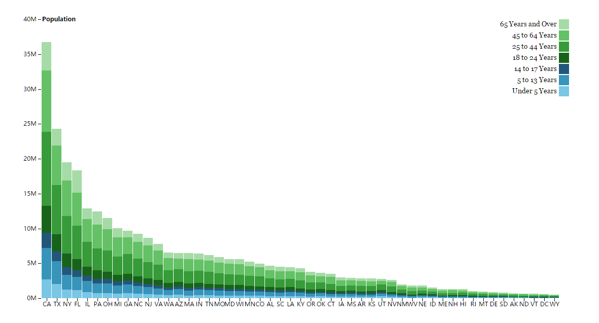

This Repo is my visualization work. It includes variety of domains: maps, data structures, high dimensional data, etc..

-------------------

Warm-up Visualization
===========
>Before I can handle an indivual project, I did some practice about how to present the data and realize the iteractive functions like **zoom**, **drag-move**, **click**, **moveover** and **moveout**. The following link is the example visualizations with interactions:
**[Example Visualizations](https://wangku.github.io/Visualizations/Practice/practice.html)**

>I also did some other regular graph like **stack bar graph**. It depends on the **[data_population.csv](https://github.com/Wangku/Visualizations/tree/gh-pages/Practice/data_population.csv)** file. The data has the following example structure:

>State|Under 5 Years|5 to 13 Years|14 to 17 Years|18 to 24 Years|25 to 44 Years|45 to 64 Years|65 Years and Over
>-------|------|-------|------|------|------|-------|------
>AL|310504|552339|259034|450818|1231572|1215966|641667
>AK|52083|85640|42153|74257|198724|183159|50277
>AZ|515910|828669|362642|601943|1804762|1523681|862573
>AR|202070|343207|157204|264160|754420|727124|407205

>It has 8 columns, first column shows the name of state, and the other seven columns show the population in different age range. First visualization I did is pretty normal stack bar graph. Different color represents different age range.

>You can also click the website link **[StackedBarChart](https://wangku.github.io/Visualizations/Practice/Stacked_Bar_Chart.html)** to see the detail.

>Then I did two variants. Same data source and same color representation, while using radial present method. You can check the following two website links finding the detail.
>
>**[Radial_Stacked_Bar_1st](https://wangku.github.io/Visualizations/Practice/Radial_Stacked_Bar_1st.html)**
>
>**[Radial_Stacked_Bar_2nd](https://wangku.github.io/Visualizations/Practice/Radial_Stacked_Bar_2nd.html)**

--------------------

Hierarchy Structure
=========
>**Hierarchy** is defined as __Data repository in which cases are related to subcases__. It can be thought of as imposing an ordering in which cases are parents or ancestors of other cases. The family histories, file/direcotry systems on computers and Object-oriented software classes are all hierarchy structure. 

>I design and implement some visualizations to present the hierarchy structure. The data I used has the following structure as example:

> id | value
>------------|------------
>flare |
>flare.analytics|
>flare.analytics.cluster|
>flare.analytics.cluster.AgglomerativeCluster|3938
>flare.analytics.cluster.CommunityStructure	|3812
>flare.animate	|
>flare.animate.Easing	|17010
>flare.animate.FunctionSequence	|5842

>The table is part of **[flare.csv](./flare.csv)** file. It has two columns, one is **id**, and the other is **value**. The **id** string is combined by one or several substrings with the symbol **'.'**. In the example table, the id **flare.analytics.cluster.AgglomerativeCluster** has one more substring than the id **flare.analytics.cluster**, that means **flare.analytics.cluster** is the parent of **flare.analytics.cluster.AgglomerativeCluster**, so it can be treated as a hierarchy structure. There are some visualizations for presenting this data:
>- Circle Packing **[CirclePackingDemo](https://wangku.github.io/Visualizations/TreeStructure/CirclePacking.html)**
>
>- Packing    **[PackingDemo](https://wangku.github.io/Visualizations/TreeStructure/Packing.html)**
>
>- Tree **[TreeDemo](https://wangku.github.io/Visualizations/TreeStructure/Tree.html)**
>
>- RadialTreeGraph **[RadialTreeDemo](https://wangku.github.io/Visualizations/TreeStructure/RadialTreeGraph.html)**
>
>- TreeMap **[TreeMapDemo1](https://wangku.github.io/Visualizations/TreeStructure/TreeMap.html)** **[TreeMapDemo2](https://wangku.github.io/Visualizations/TreeStructure/TreeMap_2nd.html)**
>
>- Sunburst **[SunburstDemo](https://wangku.github.io/Visualizations/TreeStructure/Sunburst.html)**
>

------------------

First Project
=========
>This is my first complex project which is based on Dr.Yao's Nature paper ***[Health ROI as a measure of misalignment of biomedical needs and resources](http://www.nature.com/nbt/journal/v33/n8/full/nbt.3276.html)*.**

>

>The previous image is the screenshot of my visualization. It can be dividied into three parts, the left part is **Year Legend**, the middle part is **Circle Packing** and right part is the **Detail of Selection**. **Year legend** has 12 different colors, from green to red, mapping to 12 years data. When clicking the color section, we can choose to present the data for that year or hid. Certainly we can make a choice to show or block all data by clicking **Unselect All** section. In the **Circle Packing**, so many concentric circles are presented to form a large circle. Every circle represents one type of disease, it has 12 concentric rings with 12 different colors, and larger radius means larger ROI value. Clicking the circle, the detail information like **Totol burden in million** and **Pulications** of this disease will show in the right part.

>For more deatil information, you can check the visualization showed at the following website link:
**[Nature Paper Visualization](https://wangku.github.io/Visualizations/1st%20project/NaturePaperVisualization.html)**

-----------------

